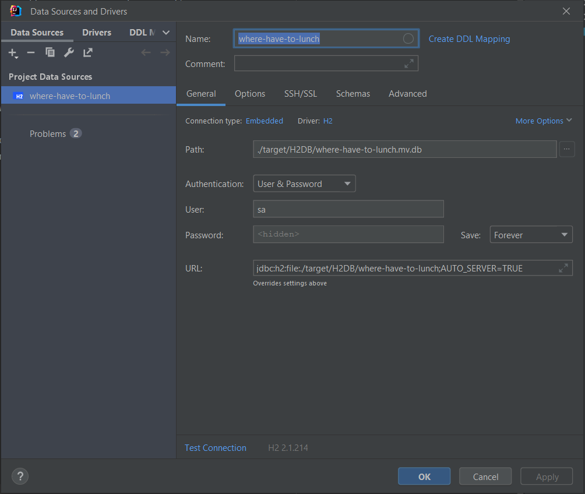

Where have to lunch is a simple application for voting for restaurant that are you going to visit today

Using application is required registration process
This process is free and from user side needed only email and password (+confirm password)

User of app can vote for lunching in restaurant in any time,
but change (update, delete) his vote is possible only before 11 a.m.

Saving or putting vote after 11 a.m is possible if user didn't vote today.
User can see restaurants and theirs menus on date (by default date is today,if date is not provided,)

Administrator of application can do all except vote process

GitHub repo:
https://github.com/antipn/where-to-have-lunch

Swagger link:
http://localhost:8080/swagger-ui/index.html#/

I have added in ./resources/postman json file with all required link with authentication data
i have added separated folders for user and for admin, this is better for testing all business cases.
(for example in user's section you can not change restaurant but in admin you can)
Folder user and admin have own authorization user (user is user@mail.ru, admin is admin@mail.ru)
all users have password is 'password' without quotes.

Optional information:
Standard port of application is 8080

I did some modification of H2 DB and you can see what happening in it with simple setting
of datasource

Name: where-have-to-lunch
Connection type: Embedded
Driver: H2
Authentication is "user & password":
username: sa
password: pass
Path:
./target/H2DB/where-have-to-lunch.mv.db
URL:
jdbc:h2:file:./target/H2DB/where-have-to-lunch;AUTO_SERVER=TRUE

here is screenshot of my settings
